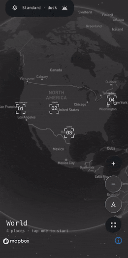
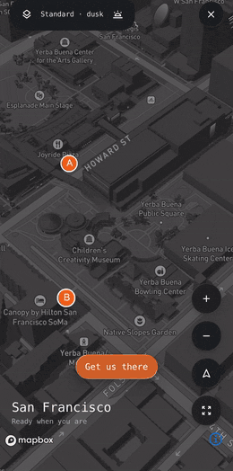
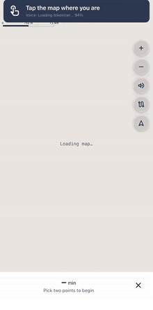

# mapbox_kit

Mapbox maps for [DartNative](https://dartpub.dev/framework). It is the
[`mapbox_maps_flutter`](https://pub.dev/packages/mapbox_maps_flutter) 2.31.0
API, so Mapbox's Flutter docs and examples apply almost line for line, on
Mapbox Maps SDK 11.31.0 for iOS and Android.

<p align="center">
  
  
  
</p>

- **Every Mapbox style** – Standard (3D buildings, light presets, themes),
  Standard Satellite, Streets, Outdoors, Light, Dark, Satellite, Satellite
  Streets, or your own from Mapbox Studio.
- **Camera** – set, ease and fly; fit a set of points; pixel ↔ coordinate.
- **Markers and lines** – point and polyline annotations with tap, long
  press and drag; style layers and sources for anything else.
- **Location puck**, gestures, compass, scale bar, logo and attribution.
- **Native speed** – the map is the real `MapView`, driven over FFI, no
  platform channels.

## 1. Quick start

### Step 1 – get a Mapbox token

Create a free account at [mapbox.com](https://account.mapbox.com/) and copy
your **public token** (it starts with `pk.`). Everything below needs it.

### Step 2 – add the package

```yaml
dependencies:
  mapbox_kit: ^0.1.0
```

```sh
dn pub get
```

That is all the wiring: `dn pub get` adds `MapboxKit.initialize()` to your
plugin registrant for you.

### Step 3 – platform setup

- **iOS**: the deployment target must be 15.0 or newer. In `ios/Podfile` set
  `platform :ios, '15.0'` and match it in Xcode (Runner target → General →
  Minimum Deployments). The pod pulls `MapboxMaps 11.31.0`.
- **Android**: nothing to add. The SDK comes from Maven Central and Mapbox's
  release repository without a download token. Make sure
  `android/app/src/main/AndroidManifest.xml` declares
  `<uses-permission android:name="android.permission.INTERNET" />`
  (a `dn create` app already does). The location puck also needs the
  location permissions.

### Step 4 – show a map

```dart
import 'package:dartnative/dartnative.dart';
import 'package:mapbox_kit/mapbox_kit.dart';

import 'dartnative_plugin_registrant.dart';

void main() {
  DartNativePluginRegistrant.registerAll();
  // Before the first MapWidget is built.
  MapboxOptions.setAccessToken('pk.your-token-here');
  runApp(const App());
}

class App extends StatelessWidget {
  const App({super.key});

  @override
  Widget build(BuildContext context) {
    return Scaffold(
      body: MapWidget(
        styleUri: MapboxStyles.STANDARD,
        cameraOptions: CameraOptions(
          center: Point(coordinates: Position(-122.3937, 37.7955)), // lng, lat
          zoom: 14,
          pitch: 45,
        ),
        onMapCreated: (MapboxMap map) {
          // Keep `map`: it is how you talk to the map from now on.
        },
      ),
    );
  }
}
```

Run it:

```sh
dn run
```

You should see San Francisco's Ferry Building with 3D buildings.

Rather not put the token in source? Keep it in a gitignored env file bundled
as an asset and read it at startup — the example's `lib/config.dart` shows a
ten-line `mapbox.env` reader built on `loadAssetBytes`.

### Step 5 – wait for the style before you draw

Markers, lines and style changes need the style to be loaded. Do that work
in `onStyleLoadedListener`, not in `onMapCreated`:

```dart
MapboxMap? _map;

MapWidget(
  styleUri: MapboxStyles.STANDARD,
  onMapCreated: (map) => _map = map,
  onStyleLoadedListener: (_) async {
    // Safe to add sources, layers and annotations from here.
  },
)
```

## 2. Guides

Each guide is a few lines you can paste into `onStyleLoadedListener`.
Positions are always `Position(longitude, latitude)`.

### 2.1 Move the camera

```dart
// Jump.
await map.setCamera(CameraOptions(
  center: Point(coordinates: Position(-73.9857, 40.7484)),
  zoom: 15,
));

// Glide (a straight ease) over 1.5 seconds.
await map.easeTo(
  CameraOptions(zoom: 16, pitch: 60, bearing: 30),
  MapAnimationOptions(duration: 1500),
);

// Fly (zoom out, travel, zoom in) over 3 seconds.
await map.flyTo(
  CameraOptions(center: Point(coordinates: Position(-104.9903, 39.7392)), zoom: 15),
  MapAnimationOptions(duration: 3000),
);

// Fit a set of points with some padding, then fly there.
final camera = await map.cameraForCoordinatesPadding(
  [for (final p in positions) Point(coordinates: p)],
  CameraOptions(pitch: 0, bearing: 0),
  MbxEdgeInsets(top: 120, left: 40, bottom: 160, right: 40),
  null,
  null,
);
await map.flyTo(camera, MapAnimationOptions(duration: 1500));

// Where is the camera now?
final state = await map.getCameraState();
print('zoom ${state.zoom} pitch ${state.pitch}');
```

`easeTo` and `flyTo` return as soon as the animation *starts*, like the
SDK. To do something when it lands, wait for the duration.

### 2.2 Drop a marker

A marker is a point annotation. Give it an image (PNG bytes) or a text
label, or both:

```dart
final markers = await map.annotations.createPointAnnotationManager();

// Always draw the icons, even where labels would collide with them, and
// in front of 3D buildings (the Standard style hides them otherwise).
await markers.setIconAllowOverlap(true);
await markers.setIconIgnorePlacement(true);
await markers.setIconOcclusionOpacity(1.0);

final marker = await markers.create(PointAnnotationOptions(
  geometry: Point(coordinates: Position(-122.3937, 37.7955)),
  image: pngBytes,            // a Uint8List, e.g. from an asset or package:image
  iconSize: 1.0,
  textField: 'Ferry Building',
  textOffset: [0, 1.5],
));

// Move it later.
marker.geometry = Point(coordinates: Position(-122.39, 37.79));
await markers.update(marker);

// Know when it is tapped.
markers.tapEvents(onTap: (tapped) => print('tapped ${tapped.id}'));

// Remove it.
await markers.delete(marker);
```

To change a marker's *image*, delete it and create a new one: an updated
image keeps its old name on iOS and the SDK keeps showing the old bitmap.

### 2.3 Draw a line

For a route or a track, use a GeoJSON source and a line layer. Add them
once, then change the data whenever you like:

```dart
final source = GeoJsonSource(
  id: 'route',
  data: '{"type":"FeatureCollection","features":[]}',
  lineMetrics: true, // needed for line-trim-offset below
);
await map.style.addSource(source);
await map.style.addLayer(LineLayer(
  id: 'route-line',
  sourceId: 'route',
  slot: 'middle',       // Standard style only: under the 3D buildings
  lineColor: 0xFFF26B1D, // ARGB
  lineWidth: 6,
  lineCap: LineCap.ROUND,
  lineJoin: LineJoin.ROUND,
));

// Put a line on it: coordinates are [lng, lat] pairs.
await source.updateGeoJSON(
  '{"type":"Feature","properties":{},"geometry":{"type":"LineString",'
  '"coordinates":[[-122.3937,37.7955],[-122.4010,37.7850]]}}',
);

// Reveal it gradually: hide the part from 60 % to the end.
await map.style.setStyleLayerProperty('route-line', 'line-trim-offset', [0.6, 1.0]);
```

Prefer an annotation? `createPolylineAnnotationManager()` and
`PolylineAnnotationOptions(geometry: LineString(...), lineColor: ..., lineWidth: ...)`
work the same way as markers, with tap and drag events. Note that
`line-trim-offset` only works on a line layer over a `lineMetrics` source.

### 2.4 React to a tap on the map

```dart
MapWidget(
  onTapListener: (context) {
    final where = context.point.coordinates; // a Position
    print('tapped ${where.lng}, ${where.lat}');
  },
)
```

A tap on a marker arrives here as well as in the marker's `tapEvents`.

### 2.5 Switch styles, light and theme

```dart
// Any built-in style, or a mapbox://styles/you/… URI from Mapbox Studio.
await map.loadStyleURI(MapboxStyles.DARK);

// Standard and Standard Satellite take a light preset and a theme.
await map.style.setStyleImportConfigProperties('basemap', {
  'lightPreset': 'dusk',          // dawn, day, dusk, night
  'theme': 'monochrome',          // default, faded, monochrome
  'show3dObjects': true,
  'showPlaceLabels': false,
});
```

Loading a style throws away your sources and layers, and
`onStyleLoadedListener` fires again: add them back there. Annotation
managers (markers, lines) carry over on their own.

### 2.6 Show the user's location

```dart
await map.location.updateSettings(LocationComponentSettings(
  enabled: true,
  pulsingEnabled: true,
  showAccuracyRing: true,
));
```

Request the location permission first (for example with
`dartnative_permissions`); the puck follows the system location.

### 2.7 Ornaments

```dart
await map.compass.updateSettings(CompassSettings(enabled: false));
await map.scaleBar.updateSettings(ScaleBarSettings(enabled: false));
await map.logo.updateSettings(LogoSettings(marginBottom: 96));
await map.attribution.updateSettings(AttributionSettings(marginBottom: 96));
```

### 2.8 Anything else in the style spec

Layers and sources that have no typed class yet go in as JSON:

```dart
await map.style.addStyleLayer(
  '{"id":"hills","type":"hillshade","source":"dem","slot":"bottom",'
  '"paint":{"hillshade-exaggeration":0.5}}',
  null,
);
await map.style.setStyleLayerProperty('hills', 'visibility', 'none');
```

## 3. The example app

`example/` is a complete app you can run straight away:

```sh
cd example
cp mapbox.env.example mapbox.env   # gitignored; put MAPBOX_ACCESS_TOKEN=pk.… in it
dn pub get
dn run -d <device-id>
```

- **Journal** – a night globe with four bracket markers. Tap one and the
  map flies down among that city's 3D buildings. Tap the map twice for A and
  B, **Get us there** fetches the driving route and runs an orange line
  along it, **Drive it in 3D** drives it with a puck and a low follow camera
  until "We are here". The pill at the top switches between all eight
  built-in styles and Standard's light presets.
- **Navigate** – turn-by-turn on Mapbox Streets: two taps for A and B,
  **Navigate there** drives the Directions route with a bearing puck, a
  maneuver banner, an ETA bar and spoken guidance synthesised on the device.

The example README has a folder map; it is the best place to copy from.

## 4. Cheat sheet

| Area | API |
| --- | --- |
| Map | `MapWidget` (map options, initial camera, style URI, all 14 map event listeners, tap / long-tap / scroll / zoom listeners), `MapboxMap` |
| Camera | `setCamera`, `getCameraState`, `cameraForCoordinates*`, `cameraForCoordinateBounds`, `coordinateBounds*ForCamera`, pixel ↔ coordinate conversion, `setBounds` / `getBounds` |
| Animation | `easeTo`, `flyTo`, `cancelCameraAnimation`; `pitchBy` / `scaleBy` / `moveBy` / `rotateBy` on Android |
| Map interface | `loadStyleURI` / `loadStyleJson`, gesture and animation flags, prefetch delta, north orientation, constrain / viewport mode, debug options, `queryRenderedFeatures`, `querySourceFeatures`, GeoJSON cluster queries, feature state, `getElevation`, `tileCover`, `snapshot`, tile cache budget |
| Style | `StyleManager`: style URI / JSON, imports and Standard import config (`lightPreset`, `theme`, `show3dObjects`, …), layers, sources, GeoJSON feature updates, lights, terrain, images, models, projection, `localizeLabels` |
| Layers & sources | `CircleLayer`, `FillLayer`, `FillExtrusionLayer`, `LineLayer`, `SymbolLayer`; `GeoJsonSource`, `RasterDemSource` (add / update / get through `StyleLayer` and `StyleSource`), anything else as JSON |
| Annotations | `PointAnnotationManager`, `PolylineAnnotationManager` with tap, long-press and drag events, every layer-level property setter and getter, `setSlot` / `getSlot` |
| Location | `LocationComponentSettings` with the default 2D puck, custom 2D and 3D pucks, pulsing and accuracy ring |
| Ornaments | gestures, logo, compass, scale bar and attribution settings |
| Options | `MapboxOptions.setAccessToken`, `MapboxMapsOptions` (base URL, data path, tile store mode, worldview, language) |

Not ported yet: circle and polygon annotation managers, viewport states and
transitions, typed interactions (`addInteraction`), offline / tile store,
snapshotter, performance statistics, map recorder, the HTTP service and the
indoor selector.

Conventions: colors are ARGB ints (`0xFF1E5EFF`), screen coordinates and
paddings are logical pixels on both platforms, images are PNG bytes,
positions are `Position(lng, lat)`.

## 5. Troubleshooting

- **Blank map, or "unauthorized" in the log** – the token is missing or
  not a public `pk.` token, or it was set after the first `MapWidget` was
  built. Set it first thing in `main()`.
- **`pod install` fails on iOS** – the deployment target is below 15.0
  (see step 3).
- **Markers do not show on Standard** – call `setIconAllowOverlap(true)`,
  `setIconIgnorePlacement(true)` and `setIconOcclusionOpacity(1.0)` on the
  manager (guide 2.2). Without them the SDK hides icons that collide with
  labels or sit behind 3D buildings.
- **A line is painted over the rooftops** – give the layer `slot: 'middle'`
  on Standard so the buildings stand in front of it.
- **My layers vanished after `loadStyleURI`** – expected: add them back in
  `onStyleLoadedListener` (guide 2.5).
- **`line-trim-offset` does nothing** – the source needs `lineMetrics: true`,
  and it works on line layers, not on polyline annotations on iOS.
- **Nothing happens right after `flyTo`** – it returns when the animation
  starts; wait for its duration before reading the camera.
- **iOS + 3D terrain** – Maps SDK 11.31.0 and 11.32.0-rc.1 draw symbol and
  line layers at sea level while the camera orbits the exaggerated terrain,
  so they vanish under the mesh at any pitch above roughly 30°. Android is
  fine. Keep exaggeration at 0 on iOS until an SDK release fixes it (not yet
  verified on a physical iPhone).

## 6. How it works

Every call is `MapboxKitInvoke(token, method, argsJson)`; every stream is
`MapboxKitListen(token, channel, argsJson)` / `MapboxKitCancel(token)`.
Replies and events come back through one dispatcher pointer registered with
the framework, so a hot restart never reaches a stale callback. `MapWidget`
is a native leaf element: the framework creates a container view and the
plugin builds the `MapView` inside it on the first mutation, then hands the
Dart side its `MapboxMap` once the view exists. Map events are subscribed
natively as soon as the view exists and replayed when Dart starts listening,
so a style that loads during a slow launch is not missed.

## 7. Attribution

The Dart API, the style layer and source classes, and the native handlers are
ported from `mapbox_maps_flutter` (BSD-3, Mapbox). Mapbox Maps SDK use is
subject to the [Mapbox terms of service](https://www.mapbox.com/legal/tos).
